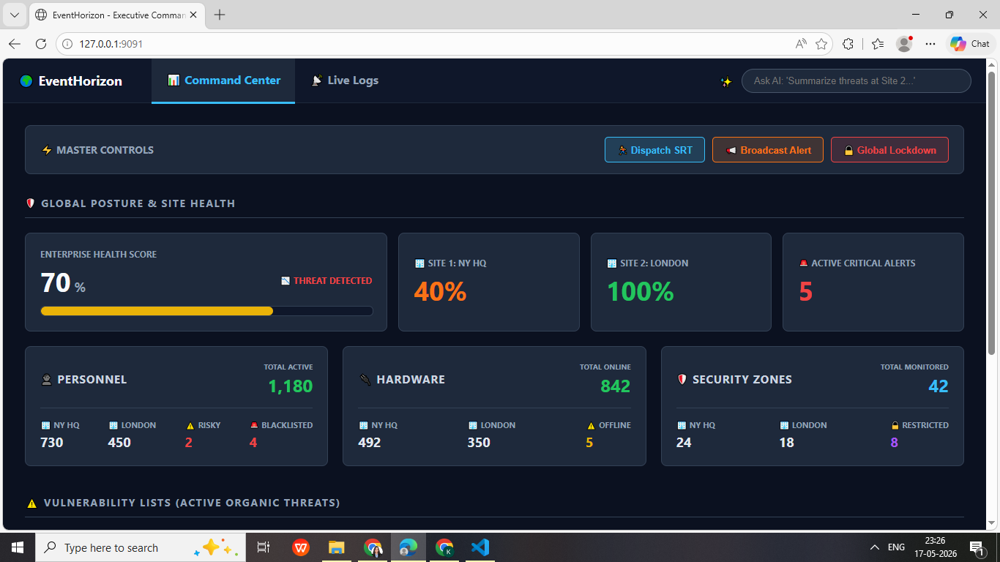
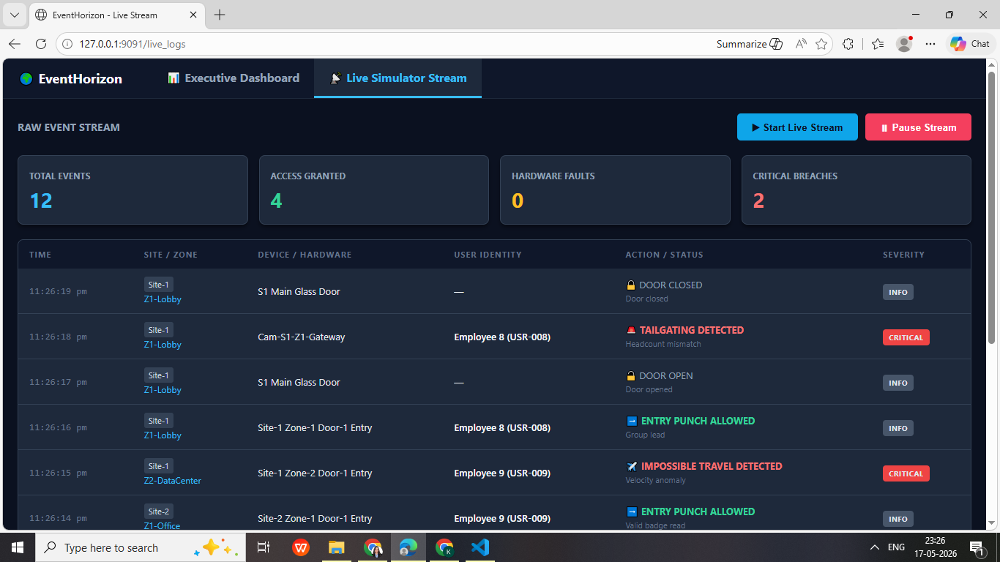
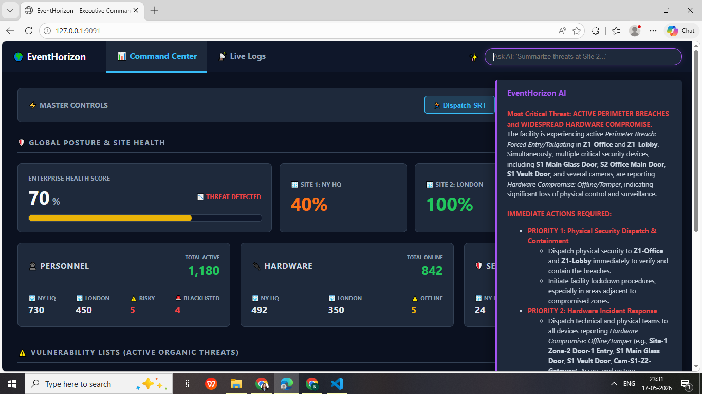
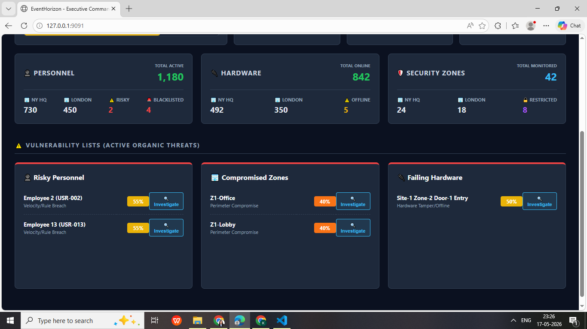
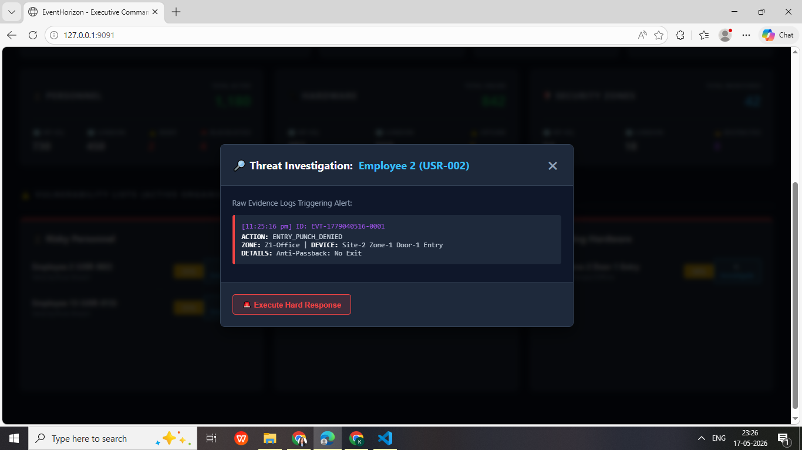
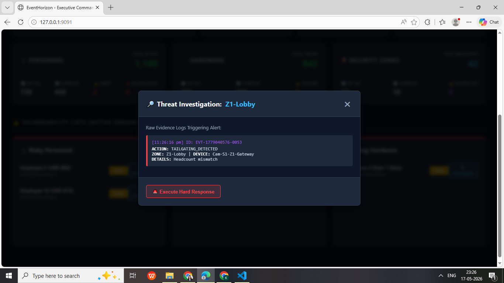

# EventHorizon — Physical Security Intelligence Layer

Enterprise security systems know everything that happened. They rarely know what it means.

Access control platforms and surveillance systems generate thousands of events daily — door opens, badge reads, device heartbeats, camera triggers. Most of it gets logged. Some of it generates alerts. Almost none of it gets interpreted. Security teams are left manually connecting dots across fragmented systems, often discovering a threat only after it has already escalated into an incident.

EventHorizon is built to close that gap. It sits above existing Physical Access Control (PACS) and IP Video Surveillance (IPVS) infrastructure as an intelligence layer — continuously processing telemetry, scoring risk across users, zones, and devices in real time, and giving operators a live, queryable view of their organisation's security posture.

---

## The Problem Worth Solving

Physical security systems today operate in binary states — allow or deny. Beyond that, they are largely passive. They capture what happened, not what it means or what is likely to happen next.

The consequence is a predictable set of failure modes that show up in security operations at scale:

- **Alert fatigue** — high event volume with no prioritisation means operators stop trusting the system and start ignoring noise.
- **Blind spots from fragmentation** — access control, surveillance, and device health exist as separate data streams with no correlation layer between them.
- **Reactive posture** — without continuous risk evaluation, threats are identified only after they become operationally visible, often too late for early intervention.
- **Manual investigation overhead** — connecting an incident to the events that preceded it requires manually querying logs, cross-referencing systems, and reconstructing timelines by hand.

These aren't edge cases. They are the default operational reality for most enterprise security teams today.

---

## What EventHorizon Does

EventHorizon processes a unified stream of PACS and IPVS telemetry and continuously evaluates risk at the entity level — across individual users, physical zones, and deployed devices.

Every event is assessed in context. Related events are correlated. Risk scores are recalculated on a rolling window every five seconds. Operators get a live dashboard showing exactly where risk is building, which entities are flagged, and why — without waiting for a manual review cycle.

When an operator needs to investigate, they can query the system in plain English. EventHorizon retrieves the current state of the facility from the database and sends it to Google Gemini to generate a grounded, contextual response — not a generic summary, but an answer tied to live operational data.

If the AI layer goes offline, a deterministic fallback engine takes over and maintains telemetry tracking and alert visibility without interruption. Security posture visibility is never dependent on a single point of failure.

---

## Intelligence Engine

The core of EventHorizon is a rule-based behavioral detection engine — a deliberate architectural choice over black-box ML at this stage. Rules are explicit, auditable, and operationally trustworthy. Security teams need to understand why something was flagged, not just that it was.

The engine evaluates a 15-minute rolling window of events and applies three behavioral threat patterns:

| Threat Pattern | Trigger | Severity |
|---|---|---|
| Velocity anomaly | Access denied or invalid credential on any user | HIGH |
| Perimeter breach | Forced entry or tailgating detected in a zone | CRITICAL |
| Hardware compromise | Device offline or tamper event detected | HIGH |

Each alert is linked directly to the raw events that triggered it — a full evidence chain that an operator can inspect without leaving the dashboard. Risk scoring runs every five seconds and rebuilds the complete alert state from the latest window, ensuring scores always reflect current conditions rather than accumulating stale data.

The roadmap moves this toward adaptive ML models that learn baseline behavioral patterns per entity and flag deviations — replacing static thresholds with dynamic, context-aware scoring over time.

---

## How It Works

```
Simulator (every 1s)
       │
       ▼
  SQLite (events table)
       │
       ├──── 15-min rolling window ────▶ Risk Scorer (every 5s)
       │                                        │
       │                                        ▼
       │                                 active_alerts table
       │                                        │
       ▼                                        ▼
  GET /stream (SSE)               GET /api/scores/users
  live event feed                     /api/scores/zones
                                      /api/scores/devices
                                      /api/evidence/{alert_id}

  POST /api/ask_ai
       │
       ├── query active_alerts → build live context (users / zones / devices)
       └── inject into prompt → Gemini 2.5 Flash → HTML response to dashboard
```

### Event simulation

The simulator generates realistic security events every second using weighted random scenarios across two sites, three zones, and nineteen users — producing a continuous, varied telemetry stream without human input.

| Scenario | What it represents | Probability |
|---|---|---|
| Normal access flow | Valid badge read, door open and close | 40% |
| Tailgating detected | Headcount mismatch at camera after valid entry | 10% |
| Door held open | Door open beyond threshold, no close event | 10% |
| Impossible travel | Same user badge-read at two different sites in quick succession | 10% |
| Hardware breach | Forced door open with no preceding badge read | 10% |
| Anti-passback violation | Entry attempt with no corresponding exit on record | 10% |
| Device offline | Heartbeat lost on any device | 10% |

Each event carries a site, zone, device ID, user ID, action type, severity, and a risk contribution payload that feeds directly into the scoring engine.

### Database schema

| Table | Purpose |
|---|---|
| `events` | Full event log — every simulated event written here |
| `active_alerts` | Live alerts rebuilt every 5 seconds by the risk scorer |
| `entity_state` | Entity location and health tracking (provisioned for next phase) |

---

## AI Investigation Layer

Natural language queries are handled through a retrieval-augmented generation pipeline built on Google Gemini 2.5 Flash.

When an operator submits a question, the system pulls live alert data from SQLite — flagged users, compromised zones, failing devices — and injects it as context into the prompt before calling the model. Gemini's response is grounded in the actual current state of the facility, not general knowledge about security systems.

This means operators can ask questions like *"which zones are at risk right now"* or *"what's happening with the data centre"* and get answers that reflect what the system is actually seeing — with HTML-formatted responses rendered directly in the dashboard.

---

## Platform Preview

### Executive Risk Dashboard


### Live Event Feed


### Ask AI Investigation


### Enterprise Risk Score


### Entity Risk Scoring


### Device Investigation


### User Investigation


### Zone Investigation


---

## Tech Stack

| Layer | Technology |
|---|---|
| Backend | Python 3 + FastAPI |
| Database | SQLite via `aiosqlite` (async) |
| AI / LLM | Google Gemini 2.5 Flash (`google-genai` SDK) |
| Real-time streaming | Server-Sent Events via `sse-starlette` |
| Frontend | HTML5, CSS3, JavaScript ES6+ |

---

## Project Structure

```
eventhorizon-project/
│
├── event_generator/
│   ├── main.py              # FastAPI server, SSE stream, REST endpoints, background loops
│   ├── simulator.py         # Weighted scenario-based event generation engine
│   ├── devices.py           # Device, zone, and user definitions across 2 sites and 3 zones
│   └── static/
│       ├── index.html       # Executive risk dashboard
│       └── live_logs.html   # Live event feed
│
├── db/
│   ├── database.py          # Schema initialisation and async event writes
│   ├── risk_scorer.py       # Rule-based behavioral threat detection engine
│   └── ai_agent.py          # Gemini RAG pipeline with deterministic fallback
│
└── .env                     # GEMINI_API_KEY
```

---

## API

| Method | Endpoint | Description |
|---|---|---|
| GET | `/stream` | SSE stream of live events |
| GET | `/api/scores/users` | Top flagged users by risk impact |
| GET | `/api/scores/zones` | Top compromised zones by vulnerability score |
| GET | `/api/scores/devices` | Top failing devices by health impact |
| GET | `/api/evidence/{alert_id}` | Raw events behind a specific alert |
| POST | `/api/ask_ai` | Natural language query → Gemini response |

---

## Setup

```bash
git clone <repository-url>
cd eventhorizon-project

python -m venv .venv
source .venv/bin/activate        # Windows: .venv\Scripts\activate

pip install -r requirements.txt
```

Create a `.env` file in the project root:

```env
GEMINI_API_KEY=your_api_key_here
```

Run:

```bash
uvicorn event_generator.main:app --host 127.0.0.1 --port 9091 --reload
```

Dashboard → `http://127.0.0.1:9091`
Live feed → `http://127.0.0.1:9091/live_logs`

---

## Roadmap

The current version establishes the intelligence layer foundation — unified telemetry, rule-based behavioral detection, real-time risk scoring, and AI-assisted investigation. The next phase moves toward predictive and adaptive capabilities:

- Adaptive ML threat models that learn per-entity behavioral baselines and flag deviations dynamically
- RTSP-based live video analytics using OpenCV for real IPVS integration
- Advanced multi-source event correlation across access control and surveillance streams
- Entity movement tracking and impossible travel detection across sites
- Automated incident response workflow triggers
- Enterprise SOC platform integrations

---

